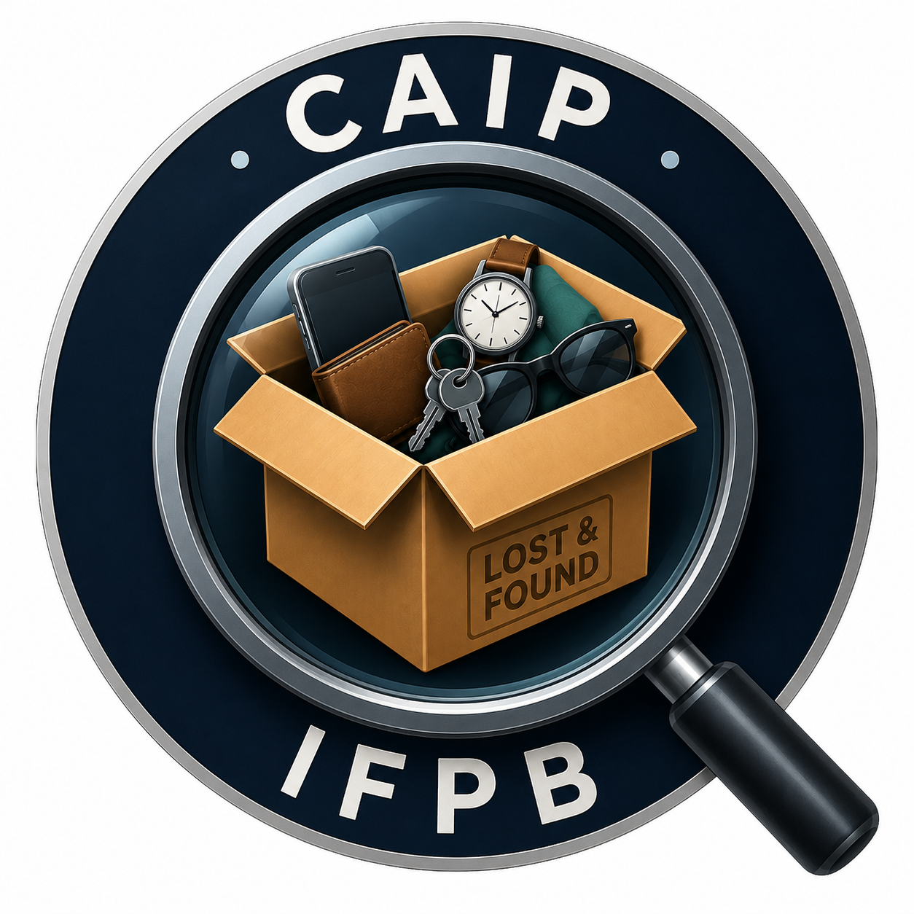

<h1 align="center">✠ Marllon Anisio ✠</h1>

  <strong>Fullstack Developer | ADS Student</strong> 
  Transformando café, energético e suor em sistemas robustos e interfaces fluidas.

  
  
  
  

 

  

---

## 👨‍💻 Sobre mim

- 🎓 **Estudante de Análise e Desenvolvimento de Sistemas (ADS).**
- 💻 **Desenvolvedor Fullstack** com foco em criar aplicações escaláveis e com código limpo.
- 🚀 Aprofundando diariamente meus conhecimentos em **arquitetura de software**, **clean code** e **boas práticas**.
- 💡 Apaixonado por tecnologia, desafios lógicos e por transformar ideias em soluções digitais.

---

## 🛠️ Stack de Experiência

  &nbsp;
  &nbsp;
  &nbsp;
  &nbsp;
  &nbsp;
  &nbsp;
  &nbsp;
  &nbsp;
  &nbsp;
  &nbsp;
  &nbsp;
  &nbsp;
  

---

## 🌱 Aprendizado Contínuo

<table align="center" border="0">
  <tr valign="top">
    <td width="50%" align="center">
      
<strong>🚀 Foco Atual</strong>

      
Desenvolvimento moderno e tipagem estrita.

      &nbsp;
      
    </td>
    <td width="50%" align="center">
      
<strong>🎯 Próximos Passos</strong>

      
Análise de dados e inteligência.

      &nbsp;
      
    </td>
  </tr>
</table>

---

## 🏆 Projetos em Destaque

<table border="0" align="center">
  <tr>
    <td width="60%" valign="top">
      <h3><a href="https://github.com/MarllonAnisio/CAIP-BackEnd">🚀 CAIP-BackEnd</a></h3>
      
API RESTful para um sistema de gerenciamento de itens achados e perdidos, construída com foco em segurança, performance e escalabilidade utilizando o ecossistema Java/Spring.

       
      <strong>Tecnologias:</strong>  
      &nbsp;
      &nbsp;
      &nbsp;
      &nbsp;
      
    </td>
    <td width="40%" valign="middle" align="center">
      
    </td>
  </tr>
</table>

---

## 📊 Atividade & Performance

  <table border="0">
    <tr>
      <td align="center">
        
      </td>
      <td align="center">
        
      </td>
    </tr>
  </table>

 

  

---

  
   
  Desenvolvido por Marllon Anisio • 2024

